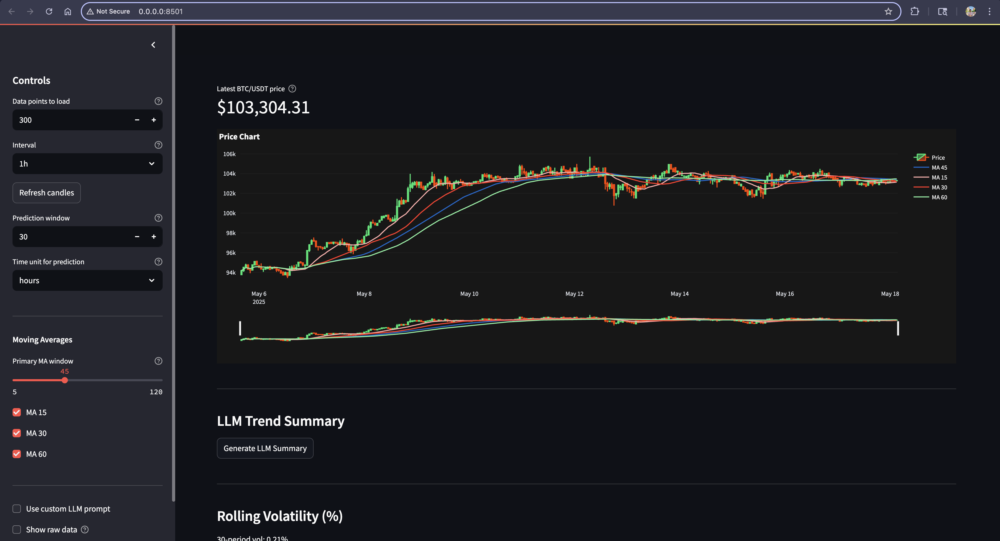
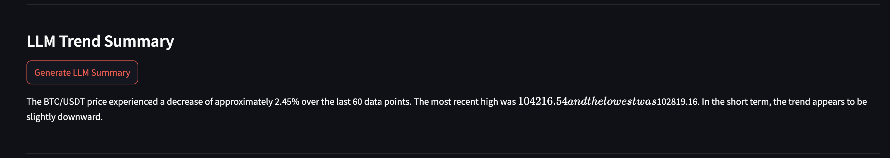
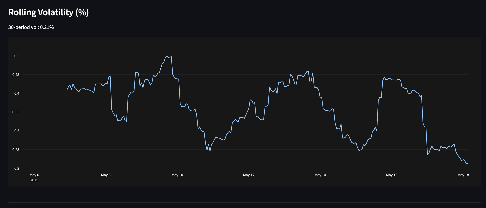
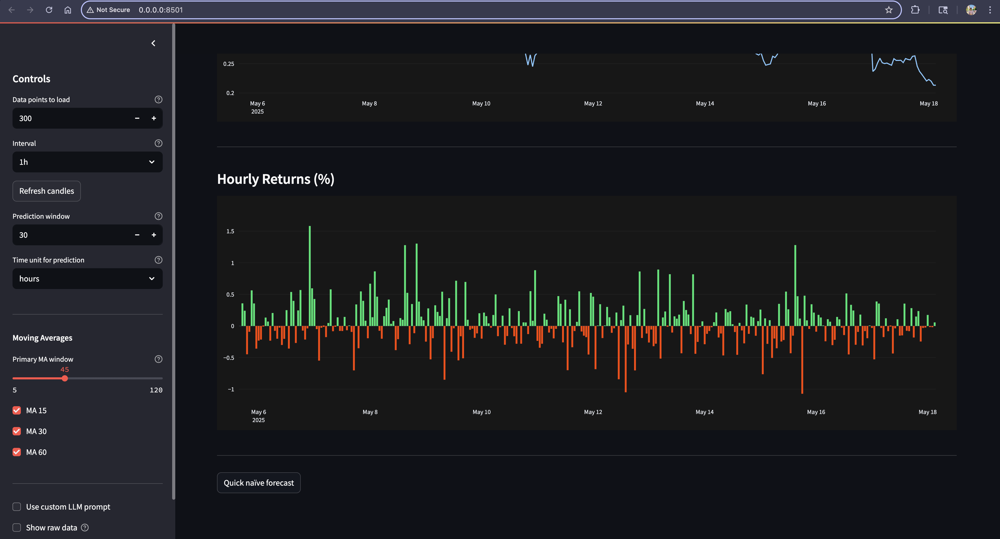
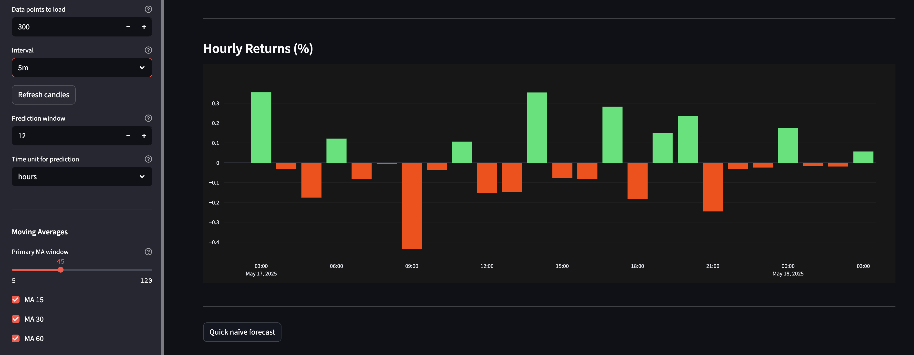
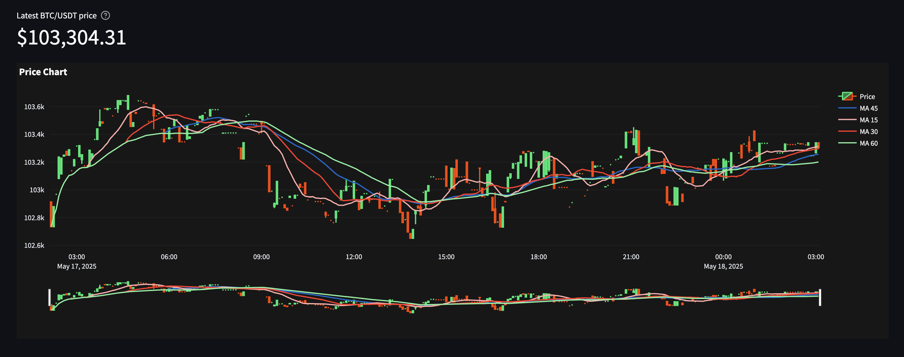
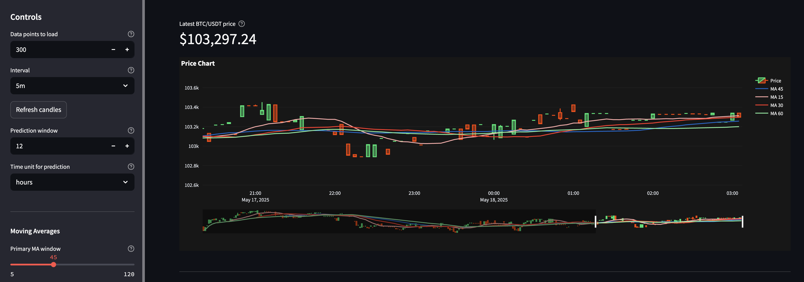

# Real-Time Bitcoin Price Analysis and Forecasting with Ollama-Python

**Course**: DATA605 – Spring 2025  
**Student**: Vikranth Reddimasu  
**Instructor**: Prof. Giacinto Paolo Saggese  

---

## Table of Contents

- [Overview](#overview)  
- [Architecture](#architecture)  
- [Key Features](#key-features)  
- [System Workflow](#system-workflow)  
- [Setup and Installation](#setup-and-installation)  
- [How to Use](#how-to-use)  
- [Dashboard Insights](#dashboard-insights)
  - [1. Price Chart Overview](#1-price-chart-overview)
  - [2. LLM Trend Summary](#2-llm-trend-summary)
  - [3. Rolling Volatility](#3-rolling-volatility)
  - [4. Hourly Returns (Full Range)](#4-hourly-returns-full-range)
  - [5. Hourly Returns (Intraday)](#5-hourly-returns-intraday)
  - [6. Intraday Price Chart](#6-intraday-price-chart)
  - [7. Controls and Forecasting](#7-controls-and-forecasting)
- [Technologies Used](#technologies-used)  
- [Limitations](#limitations)  
- [Future Work](#future-work)  

---

## Overview

This project builds a real-time Bitcoin analytics dashboard that combines live crypto price data, time-series analysis, and large language model (LLM) insights. Using the Binance API, pandas, and Ollama (for local LLM execution), this project demonstrates the fusion of data engineering, quantitative analytics, and natural language summarization.

The web-based dashboard is built using **Streamlit**, providing users with real-time charts, volatility and return metrics, and human-readable AI summaries for immediate market interpretation.

---

## Architecture

```
Binance Price API ➔ Pandas DataFrame ➔ Technical Metrics (MA, Volatility, Returns) ➔
Streamlit UI
         └──➔ LLM Prompt ➔ Ollama Python API ➔ Text Summary
```

### Description of Components:

- **Data Source**: Binance public REST API for BTC/USDT kline data.
- **Analysis Layer**: Python (pandas, numpy) for real-time metric calculations.
- **LLM Integration**: Ollama-Python connects to a local Mistral-7B model to summarize price trends.
- **UI Layer**: Streamlit frontend using Plotly for interactive charts and dynamic controls.

---

## Key Features

- Live price ingestion from Binance (interval: 1m, 5m, 1h)
- Moving average plots (MA15, MA30, MA45, MA60)
- Rolling volatility chart (standard deviation %)
- Hourly return bar chart (gain/loss visualization)
- LLM-generated natural language summaries
- Naïve baseline forecasting
- Custom prompt support for LLMs

---

## System Workflow

1. User selects number of data points, interval, and MA parameters.
2. The app fetches and caches price data (via Binance API).
3. Metrics are calculated using `pandas` and plotted with `plotly`.
4. On-demand LLM summaries are generated using `ollama`.
5. Visuals and text summaries are updated live in the dashboard.

---

## Setup and Installation

> ### Quick Start (Docker)
>
> If you have Docker installed, just run:
>
> ```bash
> docker-compose up --build
> ```
>
> This launches the dashboard on `http://localhost:8050`.

### 1. Clone the repository
```bash
git clone https://github.com/vikranth1000/tutorials.git
cd tutorials/DATA605/Spring2025/projects/TutorTask184_Spring2025_Real-Time_Bitcoin_Price_Analysis_and_Forecasting_with_Ollama-Python
```

### 2. Install Python dependencies
```bash
pip install --upgrade pip
pip install -r requirements.txt
```

### 3. Install Ollama
- [Download Ollama](https://ollama.com) for your OS
- Or pull via Docker:
```bash
ollama pull mistral:latest
```
- Start the server (default at `http://localhost:11434`)

### 4. Launch the App
```bash
streamlit run historical_analysis/streamlit_app.py
```

Or using Docker:
```bash
docker-compose up --build
```

---

## How to Use

- Use the **sidebar** to select:
  - Number of data points
  - Time interval (1m, 5m, 1h)
  - MA periods (15, 30, 60, etc.)
  - Forecasting horizon
- Click **"Generate LLM Summary"** to trigger trend analysis.
- Use **"Quick naïve forecast"** to display a trivial projection.
> `"Summarize this price trend: 27101, 27122, 27089, 27095, 27140, 27165, 27192"`

---

## Dashboard Insights

### 1. Price Chart Overview


A multi-day candlestick chart showing MAs. Displays crossovers, trend flattening, and recent consolidation patterns. Useful for detecting breakout potential.

### 2. LLM Trend Summary


Generated by querying a local Ollama-hosted LLM (Mistral-7B) using custom prompts via the Ollama-Python client. Summarizes last 60 price points, change %, highs/lows, and momentum in natural language.

### 3. Rolling Volatility


Displays 30-period standard deviation of hourly returns. Helps spot periods of market turbulence or stability.

### 4. Hourly Returns (Full Range)


Visualizes green (gain) and red (loss) bars for hourly performance across 10+ days. Detects spikes and crashes.

### 5. Hourly Returns (Intraday)


Zoomed-in daily chart using 5m intervals. Captures microstructure movements and possible mean reversion zones.

### 6. Intraday Price Chart


Refined 5m candle chart for real-time trade monitoring. Highlights MA interactions, breakouts, and wicks.

### 7. Controls and Forecasting


Streamlit sidebar with real-time sliders, prompt inputs, toggles, and forecast options. Enhances interactivity.

---

## Technologies Used

- **Python 3.12+**  
- **Streamlit** – Web-based UI framework  
- **Pandas / Numpy** – Time-series and numeric computation  
- **Plotly** – Interactive charts  
- **Binance API** – Market data source  
- **Ollama-Python** – LLM query client  
- **Docker / Compose** – Cross-platform containerization

---

## Limitations

- Forecasting model is naïve (last price projection only)
- LLM summaries may vary in quality depending on model and prompt
- App supports only BTC/USDT pair currently
- UI is minimal (no authentication or persistent storage)
- Local inference may be slow on lower-spec machines

---

## Future Work

- Integrate **ARIMA / LSTM / Prophet** models for actual forecasting
- Fine-tune LLM with historical crypto market data
- Support more symbols (ETH, BNB, etc.) via dropdowns
- Deploy online (e.g. Streamlit Cloud, GCP)
- Add **alerts**, **trading signals**, and **mobile compatibility**
- Enhance UX with tooltips, glossary, and dark/light themes

---

**Contact:**  
Vikranth Reddimasu  
vikranthreddimasu@gmail.com
