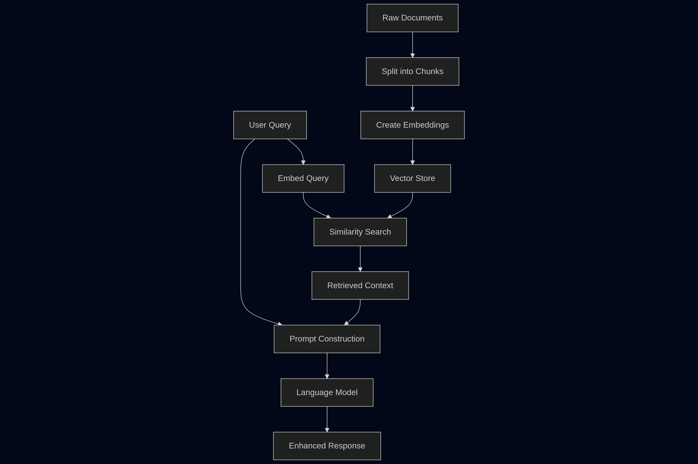
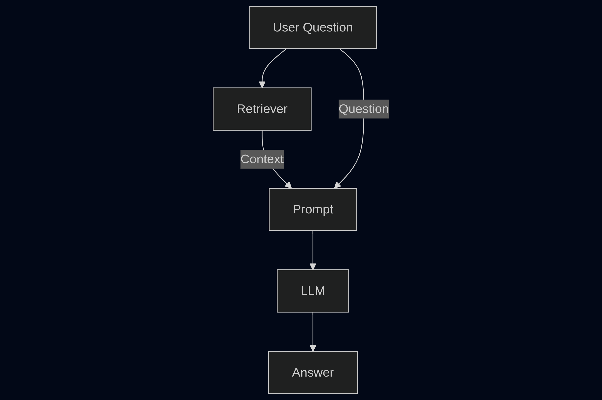
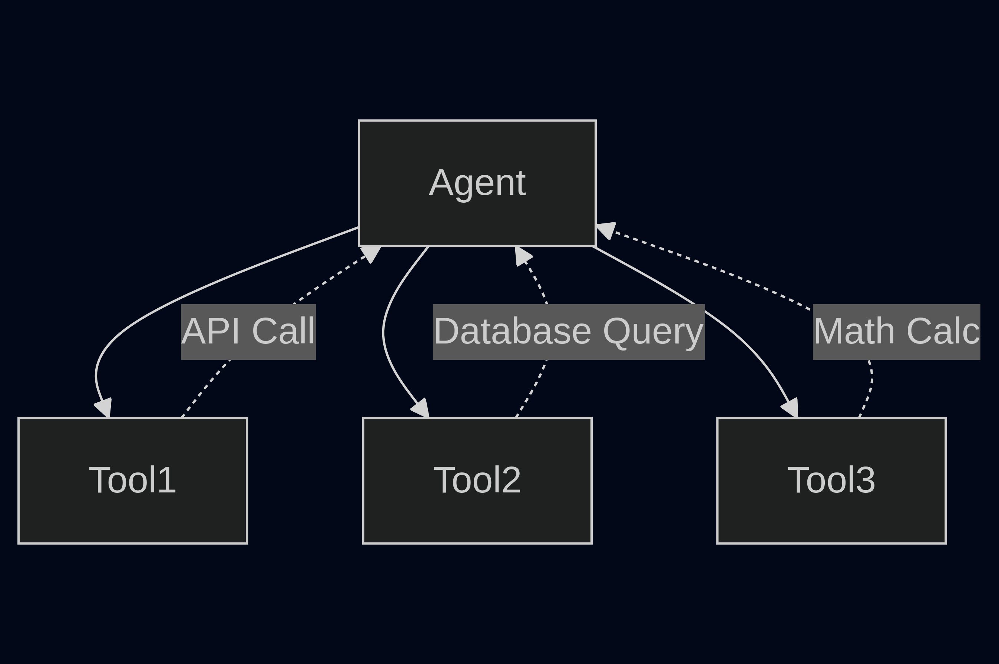

# LangChain API Tutorial

<!-- toc -->

- [Introduction](#introduction)
- [Architecture Overview](#architecture-overview)
- [Setting Up](#setting-up)
  * [Dependencies](#dependencies)
- [Message Handling](#message-handling)
- [Custom Prompts](#custom-prompts)
  * [Example Use Case](#example-use-case)
- [Chains](#chains)
  * [Example Workflow](#example-workflow)
- [Retrieval with FAISS](#retrieval-with-faiss)
  * [Example Use Case](#example-use-case-1)
  * [Key Features](#key-features)
- [Building a QA System](#building-a-qa-system)
- [Agents and Tools](#agents-and-tools)
  * [Example Use Case](#example-use-case-2)

<!-- tocstop -->

## Introduction

- LangChain is a framework designed to make LLM-based application development
  intuitive and modular
- By abstracting components like prompts, workflows, and retrieval, it allows
  the developer to focus on solving problems rather than low-level integration
  with different LLM APIs
- It simplifies the development of language model-powered applications by
  providing tools for prompt creation, chaining tasks, and integrating retrieval
  mechanisms
- This tutorial explores LangChain's core capabilities through examples, helping
  you understand how to design intelligent workflows
- More documentation details can be found at
  [LangChain Documentation](https://python.langchain.com/docs/introduction/).

This tutorial explores:

- Creating structured prompts for conversational AI.
- Combining prompts and models into reusable workflows.
- Using retrieval mechanisms like FAISS to enhance context.
- Building flexible agents for decision-making.

## Architecture Overview

LangChain is built around four key components:

- 1. Prompts
  - Prompts define the interaction between users and the language model
  - With LangChain, prompts are dynamic and parameterized, enabling reuse across
    different contexts
  - Examples include:
    - Single-turn question answering.
    - Context-aware summarization.

- 2. Chains
  - Chains represent workflows, connecting prompts, models, and output parsers
    in a pipeline, ensuring consistent processing
  - Chains help automate multi-step tasks.

- 3. Retrieval
  - Retrieval mechanisms allow you to augment your model's responses with
    external data
  - For example:
    - Searching documents for relevant context using FAISS or similar tools.
    - Passing the retrieved data to the model for more informed responses.

- 4. Agents
  - Agents can dynamically decide which tools or actions to use based on the
    input
  - This flexibility is crucial for creating adaptable systems.

## Setting Up

### Dependencies

To start, ensure you have:

1. Installed LangChain and necessary dependencies.
2. Configured your OpenAI API key.

The `ChatOpenAI` model serves as the backbone for generating responses in this
tutorial. It's configured with a low temperature (`0`) to ensure deterministic
outputs.

## Message Handling

LangChain provides `SystemMessage` and `HumanMessage` to structure
conversations. These objects enable fine-grained control:

- **SystemMessage**: Defines the assistant's behavior or scope.
- **HumanMessage**: Represents user input.

- By explicitly defining roles, you can control the assistant's responses,
  ensuring relevance and accuracy.

## Custom Prompts

Prompts are critical in defining the tasks a language model performs. LangChain
provides the `ChatPromptTemplate` for creating structured prompts. These prompts
allow dynamic input formatting, making them reusable for various applications.

This modularity ensures clarity and consistency across tasks.

### Example Use Case

Imagine creating a system to analyze patient reviews for hospitals. You can
define a prompt template that:

1. Provides clear instructions to the assistant.
2. Dynamically includes the review context and question.

## Chains

Chains are reusable workflows that link prompts, models, and parsers. They
simplify complex operations, such as:

- Processing user queries.
- Generating structured outputs.

Chains reduce boilerplate code, making your application more maintainable and
modular.

### Example Workflow

A chain could:

1. Format user input using a prompt.
2. Pass the formatted input to the language model.
3. Parse the output into a structured format (e.g., text, JSON).

## Retrieval with FAISS

Retrieval mechanisms like FAISS allow you to augment language models with
external data. FAISS (Facebook AI Similarity Search) is an efficient library for
dense vector search, making it ideal for retrieving relevant documents or
embeddings.

### Example Use Case

You might have a collection of patient reviews stored as embeddings in FAISS.
When a user queries, the system retrieves the top-matching reviews, enhancing
the assistant's ability to answer.

### Key Features

- **Embedding Creation:** Convert text into vector representations.
- **Similarity Search:** Quickly find the closest matches to a query.

## Building a QA System

Combining retrieval with chains allows you to build a robust QA system. The
workflow might look like this:

1. **Retrieve Context:** Use FAISS to fetch relevant documents based on user
   queries.
2. **Format Input:** Pass the retrieved context and user query to a prompt
   template.
3. **Generate Response:** Use the language model to create a detailed answer.

This approach improves accuracy by grounding responses in factual data, reducing
the risk of hallucination.

## Agents and Tools

Agents are flexible systems capable of deciding which tools or workflows to use
dynamically. LangChain agents can:

1. Combine multiple tools, such as retrieval mechanisms or APIs.
2. Use decision logic to select the appropriate tool based on the input.

This dynamic capability makes agents ideal for complex, multi-step tasks.

### Example Use Case

An agent could:

1. Use FAISS to retrieve documents.
2. Summarize the retrieved content.
3. Provide additional insights or suggest further reading.
