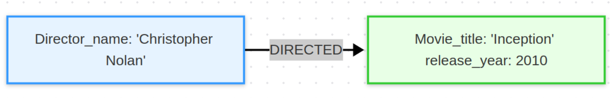
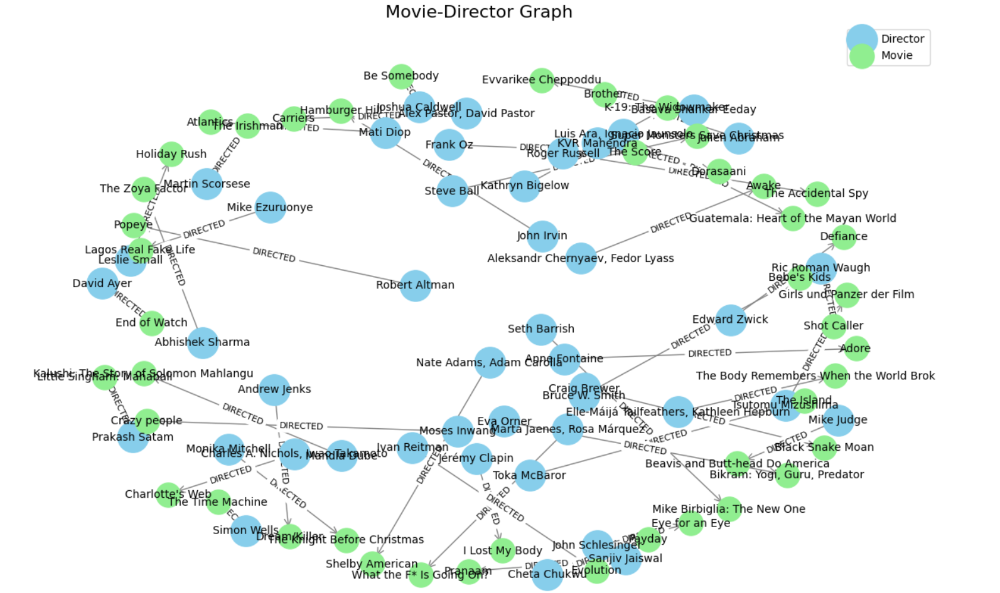

# Building and Visualizing a Movie-Director Graph with Neo4j

<!-- toc -->

- [Introduction](#introduction)
  * [Why Graphs for This?](#why-graphs-for-this)
- [API wrapper](#api-wrapper)
  * [**What are we trying to achieve with this class?**](#what-are-we-trying-to-achieve-with-this-class)
- [Project Description](#project-description)
  * [1. Data Loading & Initial Inspection](#1-data-loading--initial-inspection)
  * [2. Data Cleaning & Preprocessing](#2-data-cleaning--preprocessing)
  * [3. **Graph Construction with Neo4j**](#3-graph-construction-with-neo4j)
  * [4. **Graph Visualization**](#4-graph-visualization)

<!-- tocstop -->

## Introduction

Imagine you have a dataset filled with movies, directors, and other related
information. Now, you want to do more than just store this data in tables—you
want to see how movies connect to their directors, uncover patterns, and gain
deeper insights. That's where graph databases like Neo4j come in.

In this example, we'll:

1. Load a dataset into Python for preprocessing.
2. Use Neo4j to create a graph database that connects movies to their directors.
3. Visualize these relationships as a graph to make them easy to explore and
   understand.

### Why Graphs for This?

Graphs are an intuitive way to represent relationships. Each movie is connected
to its director, forming a natural web of relationships. Using Neo4j, we can
query and explore this data efficiently, and by visualizing it, we can reveal
connections that might otherwise be hard to see in rows and columns.

## API wrapper

The `Neo4jAPI` class is a Python wrapper that simplifies interacting with a
Neo4j database. It hides the complexities of Neo4j's API, making it easier to
load data, run queries, and visualize results. Let's break it down:

### **What are we trying to achieve with this class?**

- **Encapsulation**: Wrap Neo4j operations in reusable, easy-to-read methods.
- **Simplification**: Allow users to interact with Neo4j without needing to
  write Cypher queries repeatedly.
- **Automation**: Automate tasks like loading data into Neo4j and fetching it
  for visualization.

## Project Description

This project transforms unstructured movie data into an interactive graph
visualization using **Neo4j** and **NetworkX**. Below is a detailed breakdown of
the workflow:

### 1. Data Loading & Initial Inspection

- **Source**: Netflix dataset [`/data/netflix.csv`](/data/netflix.csv)
  containing:
  - Movie titles
  - Release years
  - Directors
  - Cast members
  - Countries of production
- **Tools**:
  - Pandas DataFrame for initial data ingestion **Output**:
  ```python
  # Sample DataFrame structure.
  | title        | release_year | director      | cast          | country |
  |--------------|--------------|---------------|---------------|---------|
  | Movie Title  | 2021         | John Doe      | Actor A, ...  | USA     |
  ```

### 2. Data Cleaning & Preprocessing

- **Key Operations**:
  1.  **Missing Value Handling**:
      - Fill empty `cast` fields with empty strings
      - Remove rows with missing `director` or `country` values
      ```python
      data['cast'] = data['cast'].fillna('')
      data = data.dropna(subset=['director', 'country'])
      ```
  2.  **Consistency Checks**:
      - Strip whitespace from `title` to avoid duplicates
      ```python
      data['title'] = data['title'].str.strip()
      ```
- **Purpose**: Ensure graph entities are unambiguous and relationships are
  accurate.

### 3. **Graph Construction with Neo4j**

- **Database Setup**:
  - Neo4j instance running locally (`neo4j://localhost:7687`)
  - Custom Python wrapper class `Neo4jAPI` for connection management
- **Node Creation**:
  - **Movie Nodes**: Labeled `Movie` with properties `title` and `release_year`
  - **Director Nodes**: Labeled `Director` with property `name`
  - Uses `MERGE` to avoid duplicates
- **Relationship Mapping**:
  - Directed edges `[:DIRECTED]` from directors to movies
  - Example Cypher query:
    ```cypher
    MERGE (movie:Movie {title: $title, release_year: $release_year})
    MERGE (director:Director {name: $director})
    MERGE (director)-[:DIRECTED]->(movie)
    ```
    

- **Batch Processing**: Iterates over DataFrame rows to populate the graph.
- **Idempotent Data Loading**: Uses `MERGE` instead of `CREATE` to prevent
  duplicates

### 4. **Graph Visualization**

- **Tools**:
  - `networkx` for graph structure
  - `matplotlib` for rendering
  - `pyvis` (optional) for interactive HTML visualizations
- **Styling**:
  - **Nodes**:
    - Directors: Blue circles
    - Movies: Green rectangles with release years
  - **Edges**: Arrows with "DIRECTED" labels
  - **Layout**: Force-directed (`spring_layout`) for optimal spacing
- **Query Logic**:
  ```cypher
  MATCH (d:Director)-[r:DIRECTED]->(m:Movie)
  RETURN d.name, m.title, m.release_year
  ```
- **Output**: A publication-ready diagram showing:
  - How directors connect to multiple movies
  - Temporal patterns (via release years)
  - Collaborative networks


