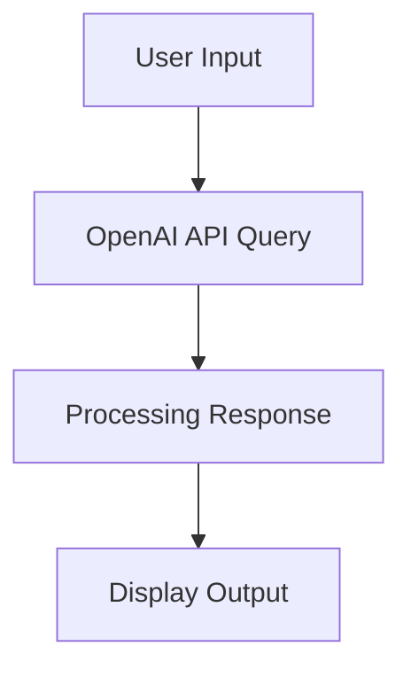
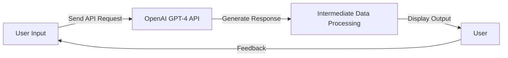

# OpenAI API Tutorial

## Overview

The OpenAI API allows developers to harness the power of advanced AI models like GPT-4 and DALL-E programmatically. Whether you're building a conversational agent, generating code snippets, or creating images, this API simplifies integrating cutting-edge AI into your applications.

**What problem does it solve?**
- Automates tasks requiring natural language understanding or generation.
- Assists in coding, debugging, and learning new concepts interactively.
- Simplifies image generation from textual descriptions.

**Alternatives**
1. **Open Source:**
   - Mistral AI models 
     - Advantages: Free, highly efficient due to its "Mixture of Experts(MoE)" architecture.
     - Disadvantages: Requires deeper knowledge of MoE for training and fine-tuning.
   - Meta’s LLaMA models
     - Advantages: Best open source models currently, efficient for various NLP tasks.
     - Disadvantages: Relatively uncensored and vulnerable to security exploits.

2. **Commercial APIs:**
   - Google’s Gemini models
     - Advantages: Advanced AI capabilities with strong multimodal support.
     - Disadvantages: Quite unreliable relative to other models.
   - Anthropic’s Claude models
     - Advantages: Best price performance, Claude Sonnet 3.5 is extremely good at coding and reasoning tasks.
     - Disadvantages: Lack of continuous updates, unlike ChatGPT.

## Getting Started

### Prerequisites
1. **Sign up:** Create an OpenAI account at [OpenAI](https://www.openai.com/).
2. **API Key:** Obtain an API key from the "View API Keys" section.
3. **Set Environment Variable:** Store the key securely as an environment variable.
   ```bash
   export OPENAI_API_KEY="<your_api_key_here>"
   ```

### Installation
Install the required Python modules, skip if using docker environment:
```python
try:
    import openai
except ImportError:
    !pip install openai

%load_ext autoreload
%autoreload 2
```

Other dependencies:
```python
import os
import logging
import pprint
import urllib
from PIL import Image
import matplotlib.pyplot as plt
import io
from typing import List, Tuple, Dict
```

## Native API Overview

### ChatGPT for Question Answering

#### Example: Customer Support

```python
# Create an agent
agent = openai.OpenAI()

# Define a function to query the assistant
def get_assistant_response(
    model: str, 
    messages: List[Dict[str, str]], 
    temperature: float = 0.7, 
    max_tokens: int = 150
) -> str:
    response = agent.chat.completions.create(
        model=model,
        messages=messages,
        temperature=temperature,
        max_tokens=max_tokens
    )
    return response.choices[0].message.content

# Example scenario
messages = [
    {"role": "system", "content": "You are a friendly and professional customer support assistant."},
    {"role": "user", "content": "Hi, I need to return a product I purchased last week. Can you tell me the process?"}
]
response = get_assistant_response(model="gpt-4o-mini", messages=messages)
print(response)
```
#### Assistant's Response:

    Of course! The return process can vary depending on the retailer, but here are some general steps you can follow:
    
    1. **Check the Return Policy**: Review the return policy of the store where you made the purchase. This information is usually found on their website or on your receipt.
    
    2. **Gather Your Items**: Make sure you have the product, any original packaging, tags, and your receipt or proof of purchase.
    
    3. **Contact Customer Service**: If you have questions or need assistance, reach out to the retailer’s customer service. They can provide specific instructions for your return.
    
    4. **Initiate the Return**: Some retailers allow you to initiate the return online. You may need to fill out a return form and

#### Escalation Scenario
```python
follow_up = [
    {"role": "system", "content": "You are a customer support assistant. If the issue is complex, escalate to a human agent."},
    {"role": "user", "content": "The product I received is damaged, and I need it replaced immediately."}
]
response = get_assistant_response(model="gpt-4o-mini", messages=follow_up, temperature=0.6)
print(response)
```
#### Assistant's Response:

    Escalation Scenario:
    I'm sorry to hear that you received a damaged product. I understand how frustrating that can be. To help you with the replacement process, could you please provide me with the following details?
    
    1. Your order number
    2. A description of the damage
    3. Any photos of the damaged product (if possible)
    
    Once I have this information, I can assist you further or escalate the issue to a human agent for immediate assistance. Thank you!


### Advanced Capabilities

#### Coding Assistant
```python
def query_coding_agent(task: str, model_name: str = "gpt-4o-mini") -> str:
    """
    Interacts with the coding assistant to complete a given task.
    
    param task: detailed description of the coding task or question.
    param model_name: name of the model to use.

    Returns: assistant's response.
    """
    try:
        # Step 1: Create the coding assistant
        coding_agent = agent.beta.assistants.create(
            model=model_name,
            name="Coding Assistant",
            description="An AI assistant skilled in programming, debugging, and code documentation.",
            instructions="You are a helpful coding assistant. You are an expert in Python, JavaScript, and debugging common errors. Assist the user by generating code snippets, fixing errors, and explaining concepts in simple terms."
        )
    
        # Step 2: Create a thread for the task (conversation with the assistant)
        thread = agent.beta.threads.create()

        # Step 3: Send the coding task to the assistant
        message = agent.beta.threads.messages.create(
            thread_id=thread.id,
            role="user",
            content=task
        )

        # Step 4: Run the assistant to execute the task and get the response
        run = agent.beta.threads.runs.create_and_poll(
            thread_id=thread.id,
            assistant_id=coding_agent.id,
            instructions="Please respond with the solution to the user's coding problem."
        )

        # Step 5: Check if the task was completed and retrieve the assistant's response
        if run.status == 'completed':
            messages = agent.beta.threads.messages.list(
                thread_id=thread.id
            )
            # Return the first message from the assistant's response
            return messages.data[0].content[0].text.value
        else:
            return f"Task not completed. Status: {run.status}"

    except Exception as e:
        return f"An error occurred: {str(e)}"

# Example usage
task_description = "Write a Python function to calculate the factorial of a number using recursion."
response = query_coding_agent(task_description)
print(response)
```
#### Response from Coding Agent:
    
    Certainly! Below is a Python function that calculates the factorial of a number using recursion:
    
    ```python
    def factorial(n):
        # Base case: if n is 0 or 1, return 1
        if n == 0 or n == 1:
            return 1
        # Recursive case: n * factorial(n - 1)
        else:
            return n * factorial(n - 1)
    
    # Example usage:
    number = 5
    print(f"The factorial of {number} is {factorial(number)}")
    ```
    
    You can call the `factorial` function with a non-negative integer, and it will return the factorial of that number. Note that the factorial is defined for non-negative integers, and the function will work correctly as long as you pass an appropriate value.

#### Debugging and Refactoring
```python
debug_task = """
Here is my code:
def add_numbers(a, b):
print(a + b)
I'm getting an IndentationError. Can you fix it?
"""
debug_response = query_coding_agent(debug_task)
print(debug_response)
```


    Debugging Response:
    The `IndentationError` in your code is likely due to the lack of proper indentation for the `print` statement inside the `add_numbers` function. In Python, the body of a function must be indented.
    
    Here’s the corrected code:
    
    ```python
    def add_numbers(a, b):
        print(a + b)
    ```
    
    Make sure to always indent the lines inside a function or any block (like loops or if statements) to avoid such errors. You can use either spaces or tabs for indentation, but it's recommended to use spaces (commonly four spaces) for consistency.


#### Image Generation with DALL-E

OpenAI offers access to its DALL-E model through an API. DALL-E is a multimodal version of GPT-3, containing 12 billion parameters, designed to convert text descriptions into images. It has been trained on a vast collection of text-image pairs sourced from the web (including Wikipedia), allowing it to generate images based on written prompts. This model is accessible through the same API.

```python
def generate_image(prompt: str):
    com = agent.images.generate(prompt=prompt, n=1, size="512x512")
    url = com.data[0].url
    image_data = urllib.request.urlopen(url).read()
    image_file = io.BytesIO(image_data)
    image = Image.open(image_file)
    plt.imshow(image)
    plt.axis('off')
    plt.show()

prompt = "A futuristic cyberpunk cityscape at night with neon lights."
generate_image(prompt)
```
#### Generated Image

    

    

## Docker Environment

To ensure a reproducible and isolated environment for the tutorial, use the provided Docker container.

### Building and Running the Docker Container
1. **Activate virtual environment:**
   ```bash
   source dev_scripts_tutorial_data/thin_client/setenv.sh
   ```
2. **Build Docker Image:**
   ```bash
   i docker_build_local_image --version 1.0.0
   ```
3. **Run Container:**
   ```bash
   i docker_bash --skip-pull --stage local --version 1.0.0
   ```
4. **Launch Jupyter Notebook:**
   ```bash
   i docker_jupyter --skip-pull --stage local --version 1.0.0 -d
   ```

## OpenAI API Architecture



### Enhanced Flowchart Example



## References
- [OpenAI API Documentation](https://platform.openai.com/docs/)

